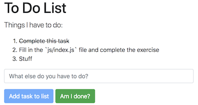

# Problem: To Do List (DOM)

In this exercise, you will practice writing JavaScript to work with DOM events and implement a simple to-do-list app:

To complete the exercise, edit the included **`js/index.js`** file to add in the code described in the comments. Note that you should ___not___ edit the HTML file!

You can see the results of your work either by opening up the included `index.html` file in a browser. Remember to refresh the page after you update your code, and to check for any errors in the Developer console.
